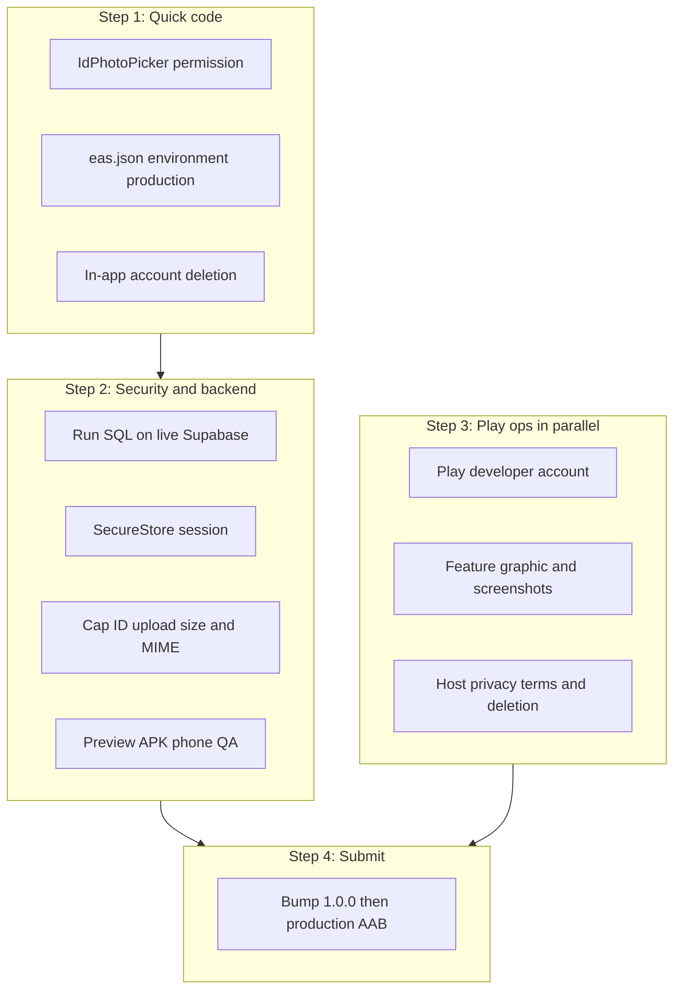

# Uni Deals — Launch readiness

What’s left before security and Google Play. The student, partner, and admin
product is already built. Do **not** start a new feature track.

1. Finish the items in this file that are not already on [SECURITY.md](SECURITY.md)
2. Sign off [SECURITY.md](SECURITY.md)
3. Follow [PLAY_STORE.md](PLAY_STORE.md)

**After the app is live on Play:** apply
`unideals/supabase_reveal_deal_code_cutover.sql` in Supabase (full steps in
[md/REVEAL_PROMO_CODE.md](md/REVEAL_PROMO_CODE.md)). Do not run it before then.

Do not upload a preview APK to Play. The store binary is the EAS `production`
App Bundle.

---

## Already done (do not rebuild)

Student: auth (email + Google), deals, events, saved, search, verification,
Student Pass, online codes, in-store QR.

Partner: deals CRUD, scanner, brand, analytics.

Admin: verifications, deals/events, users, inquiries, blog manager, brands,
analytics.

Push pipeline is coded (`notify-students` + SQL files). No in-app payments
(by design).

**Intentionally not in the app** (website-only, fine for Play v1):

- Student blog reader
- Public brand directory
- Admin brand impersonation
- Apple App Store, dark mode, Sinhala

---

## Do now (before or with security)

These are **not** on SECURITY.md, but they will fail Play review or phone QA.

- [ ] **In-app account deletion** — Play requires account deletion **in the
      app** and via a **public web URL**. Profile only has Sign out
      (`src/screens/ProfileScreen.tsx`). Privacy currently says email support
      (`src/lib/legalContent.ts` §8). The client anon key cannot call
      `supabase.auth.admin.deleteUser()` — that needs the service role.

      Implementation: Profile → Account → Delete account (confirmation
      alert) plus a hosted page on `unideals.co`. Backend is a Postgres RPC
      `request_account_deletion()` or a small Edge Function that deletes
      `auth.users` (cascade) or queues deletion. Fold into the security
      pass. Never put the service role in Expo env.
- [x] **ID photo picker permission** — `IdPhotoPicker` in
      `src/components/VerificationPanel.tsx` now calls
      `requestMediaLibraryPermissionsAsync()` before
      `launchImageLibraryAsync()`, matching `ImagePickerField`. Without this,
      Android 13+ granular media permissions can fail silently on student ID
      upload.
- [ ] **Confirm SQL is live** on the shared Supabase project. Repo SQL is
      “run in the editor,” not auto-migrated:
      - `supabase_yearly_student_verification.sql`
      - `supabase_push_notifications.sql`
      - `supabase_webhook_http_request.sql`

      Until yearly SQL is applied, `src/lib/studentVerification.ts` **trusts
      `is_verified` forever** if `verified_at` is missing (`if (!expires)
      return true`). Expired students keep codes. Push will not send without
      the other two scripts + webhooks.
- [ ] **Age / school students** — The app has `student_type: "school"`
      (`app/edit-profile.tsx`, `VerificationPanel`) and `high_school_only`
      events. Terms have **no minimum age**.

      **Play Families Policy:** if Target audience includes under-13 (or
      the app is declared “designed for children”), the listing falls under
      Families Policy / COPPA-style rules, device-ID restrictions, and a
      harder review. Recommended v1: keep school (A/Level, typically 16–19)
      but target **13 and older**, and state in Data Safety that the app is
      **not directed at children under 13**. Align `legalContent.ts` with
      that. Do not leave targeting implicit.
- [x] **Production EAS env flag** — `eas.json` `build.production` now has
      `"environment": "production"` (preview already had `"preview"`).
      Without this, EAS does not inject Dashboard `production` secrets, and
      the AAB can launch on `ConfigMissingScreen`.

      Still required in the Expo dashboard (also on SECURITY.md): set
      `EXPO_PUBLIC_SUPABASE_URL` and `EXPO_PUBLIC_SUPABASE_ANON_KEY` on the
      **production** environment.

---

## Security pass

Follow [SECURITY.md](SECURITY.md) as written. Highest-signal **repo** items:

- [ ] Persist session with SecureStore, not AsyncStorage (`src/lib/supabase.ts`)
- [ ] Cap ID upload size/type (`src/lib/verificationDocuments.ts`)
- [ ] Expand privacy copy for ID photos, camera, push (`src/lib/legalContent.ts`
      + hosted `unideals.co/privacy`)
- [ ] Align Supabase Auth password rules with `src/lib/passwordPolicy.ts`
- [ ] Abuse-test RLS / RPCs / Storage with a student JWT (UI guards in
      `app/_layout.tsx` are not security)

Plus console work: private `verification-documents` bucket, Edge Function
auth (`send-verification-otp` / `send-verification-rejected`), tight redirect
allowlist (drop production `exp://**`).

**Preview APK QA** on a real phone is part of that gate (login, verify, code,
scanner, admin approve, push). There is no automated test suite — phone QA
is the gate.

---

## Launch ops (after SECURITY.md is signed off)

From [PLAY_STORE.md](PLAY_STORE.md). None of this is missing product code.

- [ ] Host public https privacy, terms, **and account deletion**
      (in-app `/privacy` is not enough; Play also wants a web deletion URL)
- [ ] Feature graphic **1024×500** — not in `assets/` yet (icon/splash exist)
- [ ] Screenshots, Data safety, IARC, camera/photo justifications
- [ ] Reviewer test accounts (student + partner)
- [ ] Bump `app.json` version `0.1.0` → `1.0.0`
- [ ] Pay $25 / identity verification **in parallel** with the security gate
- [ ] Production AAB only (never upload preview APK)
- [ ] After first AAB: add Play **app-signing SHA-1** next to the EAS SHA-1

Typical first listing: **2–4 weeks**; **+2 weeks** if Play requires 14-day
closed testing.

---

## Nice-to-have (not blocking Play)

| Item | Why it can wait |
| --- | --- |
| Restore native date picker (`src/components/DateTimeField.tsx`) | Partners can type dates; do after next native rebuild |
| Sentry / ErrorBoundary | No crash telemetry today; add if you want visibility on first users |
| Offline banner | Feeds already have Retry / pull-to-refresh |
| Product analytics SDK | Partner “analytics” is redemption stats, not telemetry |
| Tests / CI | Zero tests; add after launch if you want |
| Android App Links, Firebase App Check | Already marked post-listing in SECURITY.md |
| Student Pass QR without raw UUID | Post-listing |

---

## Suggested order

1. **Quick code (1–2 days):** ID picker permission and EAS `environment`
   flag are done. Next: account-deletion button + Edge Function/RPC, then
   confirm SQL, decide 13+ targeting, start SECURITY.md.
2. **Security (2–3 days):** SECURITY.md blockers + preview APK
   abuse/happy-path QA on a real phone.
3. **In parallel:** Play account ($25), listing assets, hosted
   privacy/terms/deletion on `unideals.co`.
4. **Then:** bump to `1.0.0`, production AAB, internal track, Play
   app-signing SHA-1 on the Firebase Android key, review.

Do **not** port blog, brand directory, impersonation, or iOS before launch.
