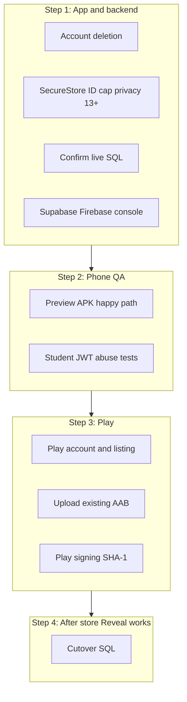

# Uni Deals — Launch plan

**Ordered remaining list:** [REMAINING_WORK.md](REMAINING_WORK.md) (website first, then this app). Same copy lives in `unideals/REMAINING_WORK.md`.

Do **not** submit to Play yet. Do **not** run cutover SQL yet.

The student, partner, and admin product is already built. Do **not** start a
new feature track. Ignore blog, iOS, dark mode, and Sinhala.

Work in this order: **app + backend → phone QA → Play Console**.

Details: [SECURITY.md](SECURITY.md) (gate) then [PLAY_STORE.md](PLAY_STORE.md)
(listing). Reveal cutover: [md/REVEAL_PROMO_CODE.md](md/REVEAL_PROMO_CODE.md).

---

## Remaining before Play

### 1. App + website code

- [ ] **Delete account** in the app (`src/screens/ProfileScreen.tsx` is Sign
      out only) plus a public page on unideals.co. Needs an RPC or Edge
      Function with the service role — never in Expo env.
- [ ] **SecureStore** for the Supabase session (`src/lib/supabase.ts` still
      uses AsyncStorage)
- [ ] **Cap ID upload** size/type in `src/lib/verificationDocuments.ts`
- [ ] **Privacy/terms copy:** ID photos, camera (partner scanner), push
      tokens, **13+ / not for under-13**, deletion path — in
      `src/lib/legalContent.ts` and the hosted pages
- [ ] Confirm these SQL files are **applied on live Supabase:** yearly
      verification, push notifications, webhook HTTP

### 2. Supabase / Firebase console (same project as the website)

- [ ] **Storage:** `verification-documents` private; students upload only to
      their uid; cannot download others’ IDs; admins via signed URLs; no ID
      photos in public `avatars` / `deal-images`
- [ ] **RLS:** a student JWT must fail reading `redemption_code` from
      `deals`, other users’ tickets/IDs, other partners’ deals, admin RPCs,
      `validate_instore_ticket`, and updating `user_roles`. Partners mutate
      only their deals
- [ ] **Edge Functions:** `send-verification-rejected` admin-only;
      `send-verification-otp` authenticated + rate-limited
      (`notify-students` is already service-role only)
- [ ] **Auth:** production redirects only `unideals://auth/callback` and
      `unideals://reset-password` (drop production `exp://**` if you can
      live without Expo Go); Google OAuth is `co.unideals.app`; dashboard
      password rules match the app (8+, upper, lower, digit)

### 3. Phone QA (preview APK, not Play)

- [x] Happy path: login / Google / reset, ID verify, **Online Reveal** (need
      a live Online deal), in-store QR + scanner, admin approve/reject, push
- [x] Abuse: student JWT cannot steal IDs, other partners’ codes, or admin
      RPCs

### 4. Play Console (after 1–3)

- [x] Pay $25, identity verification, create app `co.unideals.app`
- [ ] Store listing: 512 icon, **1024×500 feature graphic**, screenshots,
      short/full description, Data safety, IARC, 13+ audience, camera/photo
      justifications, reviewer student + partner logins
- [ ] Upload the existing production **AAB** (not a preview APK) to Internal
      testing
- [ ] After that upload: add **Play app-signing SHA-1** on the Firebase
      Android key (keep the EAS SHA-1)
- [ ] Promote Internal → Closed (if Console requires 14-day testers) →
      Production

Typical first listing: **2–4 weeks**; **+2 weeks** if Play requires 14-day
closed testing.

---

## Already done (skip)

- Reveal RPC on `main` (`reveal_online_deal_code`). Do not rebuild Explore
  brands or Online Reveal.
- Production EAS env: `eas.json` `environment: production`, and
  `EXPO_PUBLIC_SUPABASE_URL` / `EXPO_PUBLIC_SUPABASE_ANON_KEY` on the Expo
  **production** environment
- Production AAB **1.0.0** (versionCode 2) on Expo — do not rebuild unless
  native/config changed. Do not upload a preview APK.
- ID photo picker permission in `VerificationPanel` (uncommitted locally)
- Website public `/privacy` and `/terms` (copy still needs ID/camera/push +
  13+; there is **no** `/delete-account` page)

Student: auth (email + Google), deals, events, saved, search, verification,
Student Pass, online codes, in-store QR.

Partner: deals CRUD, scanner, brand, analytics.

Admin: verifications, deals/events, users, inquiries, blog manager, brands,
analytics.

Push pipeline is coded (`notify-students` + SQL files). No in-app payments
(by design).

**Intentionally not in the app** (website-only, fine for Play v1): student
blog reader, public brand directory, admin brand impersonation, Apple App
Store, dark mode, Sinhala.

---

## Not before Play

- [ ] **`supabase_reveal_deal_code_cutover.sql`** — only after the store
      install Reveals a code. Website repo, Supabase SQL editor. See
      [md/REVEAL_PROMO_CODE.md](md/REVEAL_PROMO_CODE.md).
- Nice-to-haves: Sentry, tests, App Links, App Check, Student Pass QR
  change, date picker, iOS

---

## Extra notes (do not treat as a second list)

**Delete account:** Profile is Sign out only. Privacy currently says email
support (`src/lib/legalContent.ts` §8). The client anon key cannot call
`supabase.auth.admin.deleteUser()`.

**Yearly SQL:** until it is applied, `src/lib/studentVerification.ts` trusts
`is_verified` forever if `verified_at` is missing. Expired students keep
codes. Push will not send without the push + webhook scripts.

**Age:** the app has `student_type: "school"` and `high_school_only` events.
Keep school (A/Level, typically 16–19) but target **13 and older** in Data
safety. Do not declare the app as designed for children.

**SecureStore / ID cap / privacy / password rules / RLS abuse-test:** still
open in [SECURITY.md](SECURITY.md). UI guards in `app/_layout.tsx` are not
security.

