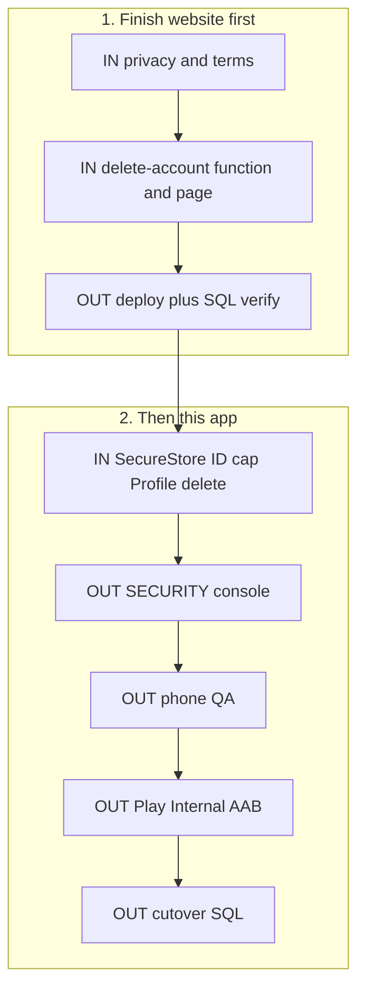

# Remaining work — website first, then app

Same plan as [`unideals/REMAINING_WORK.md`](../unideals/REMAINING_WORK.md). Read this so you do not mix old checklists.

**IN** = code in a repo. **OUT** = Supabase / Vercel / Play / crawlers.

Do **website steps 1–6 first** (other folder), then this app for steps 7–16.

Do **not** submit to Play yet. Do **not** run cutover SQL yet.

Do **not** rebuild Reveal, Explore brands, or a new AAB unless native/config changed.

Related: [LAUNCH.md](LAUNCH.md), [SECURITY.md](SECURITY.md), [PLAY_STORE.md](PLAY_STORE.md), [md/REVEAL_PROMO_CODE.md](md/REVEAL_PROMO_CODE.md).

---

## 1. Website — finish first (`unideals`)

Work in the **website** folder, not here.

### IN (`../unideals`)

- [x] **1. Privacy + terms copy** in `src/pages/PrivacyPolicy.jsx` and `src/pages/TermsOfService.jsx`
  - ID document storage, partner scanner **camera**, app **push** tokens
  - **13+ / not designed for under-13**
  - Real deletion path (not “email support only”)
  - Contact stays `unideals.lk@gmail.com`
- [x] **2. Delete-account Edge Function** (JWT + service role, caller only; never put the service role in Expo or Vite env)
- [x] **3. Public page** `https://www.unideals.co/delete-account` (Play needs this **without** installing the app)

### OUT

- [x] **4.** Deploy the new Edge Function from the website repo
- [x] **5.** Verify live SQL / env (private ID bucket, admin-gate, hide-finished, yearly/push SQL, Auth allowlist, Vercel `VITE_SUPABASE_*`). GA4/Clarity are **already live** — do not create new accounts
- [ ] **6.** Do **not** run `../unideals/supabase_reveal_deal_code_cutover.sql`

Website playbook A–D and parity 0–4 are already shipped. After 1–6, **stop website features**.

---

## 2. App — after website stop (this folder)

### IN

- [x] **7.** Sync [src/lib/legalContent.ts](src/lib/legalContent.ts) with the website privacy/terms (same 13+, camera, push, deletion URL `https://www.unideals.co/delete-account`)
- [x] **8.** **SecureStore** for the Supabase session — replace AsyncStorage in `src/lib/supabase.ts`
- [x] **9.** **Cap ID upload** size/type in `src/lib/verificationDocuments.ts`
- [x] **10.** **Profile delete account** — call the **same** Edge Function as the website; keep Sign out separate (`src/screens/ProfileScreen.tsx`)

### OUT

- [x] **11.** Live checks in [SECURITY.md](SECURITY.md): private ID bucket; student JWT cannot read `deals.redemption_code` from the table, others’ IDs/tickets, admin RPCs; Edge Function gates; production Auth redirects `unideals://auth/callback` and `unideals://reset-password` (`exp://**` removed). Play app-signing SHA-1 stays step 14
- [ ] **12.** Phone QA on a **preview APK** (not Play): login / Google / reset, ID verify, **Online Reveal** (need a live Online deal), in-store QR + scanner, admin approve/reject. Abuse: student JWT cannot steal IDs/codes
- [ ] **13.** Play Console: listing (512 icon, **1024×500 feature graphic**, screenshots, Data safety, IARC, 13+ audience, camera/photo justifications, privacy URL, **delete-account URL**). Upload the **existing production AAB** to Internal testing — not a preview APK. See [PLAY_STORE.md](PLAY_STORE.md)
- [ ] **14.** After that upload: add **Play app-signing SHA-1** on the Firebase Android key (keep the EAS SHA-1)
- [ ] **15.** Promote Internal → Closed (if required) → Production
- [ ] **16.** After a **store** install Reveals an online code: apply `../unideals/supabase_reveal_deal_code_cutover.sql` **once**. See [md/REVEAL_PROMO_CODE.md](md/REVEAL_PROMO_CODE.md)

---

## 3. After Play (OUT only)

- [ ] **17.** Screaming Frog on `https://www.unideals.co`
- [ ] **18.** Google Rich Results on one deal URL and one blog URL
- [ ] **19.** Lighthouse / Search Console CWV
- [ ] **20.** Strix (or similar) on **staging**, not production
- [ ] **21.** Weekly Clarity replays (IDs already live)
- [ ] **22.** Later, not now: partner badge, CORS, CSP, union backlinks, one content pipeline

---

## Already done — do not redo

- Reveal RPC on `main` (`reveal_online_deal_code` in `app/deal/[id].tsx`)
- Explore brands
- Production EAS env and production AAB **1.0.0** (versionCode 2) — do not rebuild unless native/config changed
- Website batches A–D and parity 0–4
- Additive `supabase_reveal_deal_code.sql` (applied). Cutover file is **not** applied on purpose
- GA4 `G-V1KKPJDS91` and Clarity `ybcb02nvec` on www — do not create a second property

---

## Skip / later (not this queue)

- Blog reader, iOS, dark mode, Sinhala
- Campus hubs, extra Brands navbar, Hotjar, Redis/KV
- Partner badges, CORS tighten, CSP until after Play
- Cutover SQL **before** the store Reveal works
- A second analytics account
